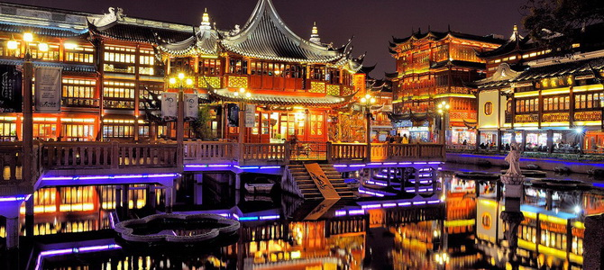
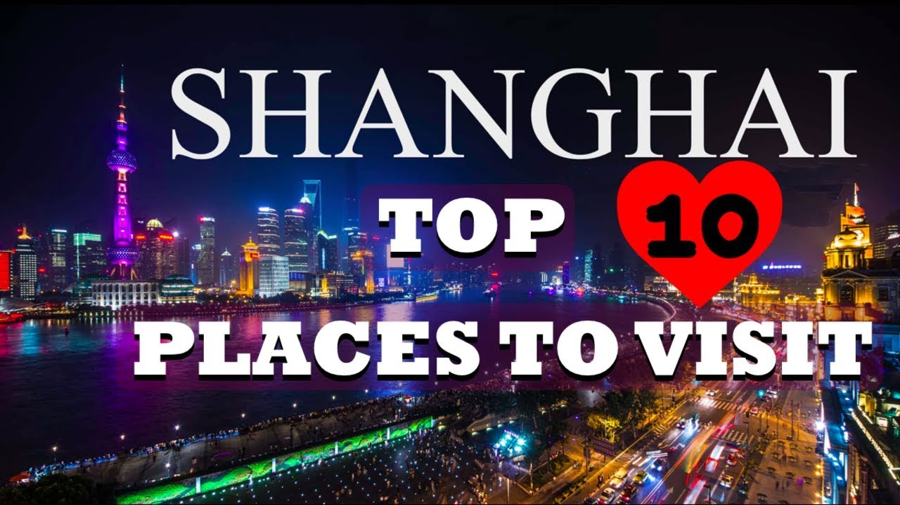
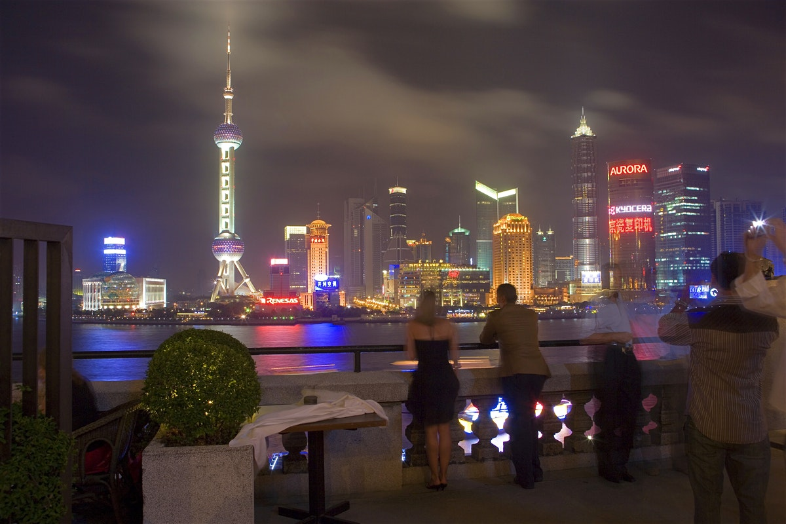
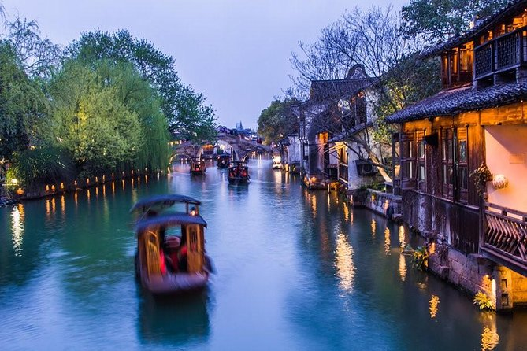
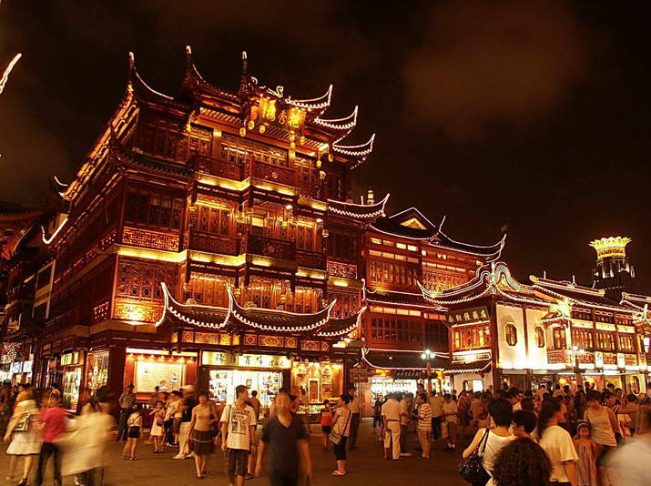
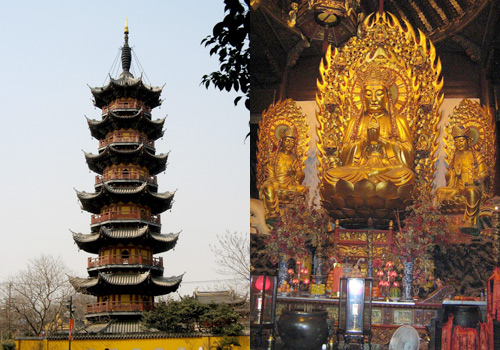
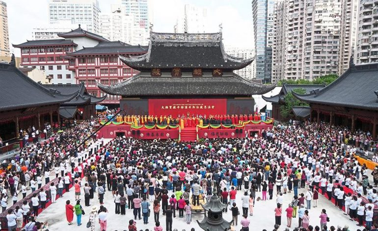
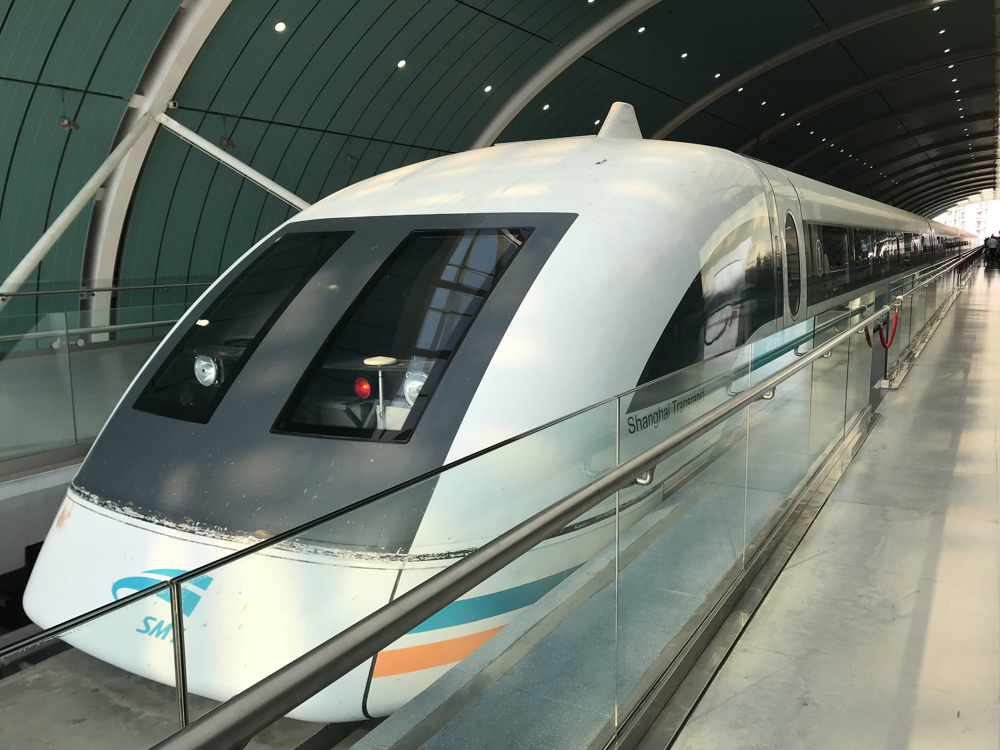
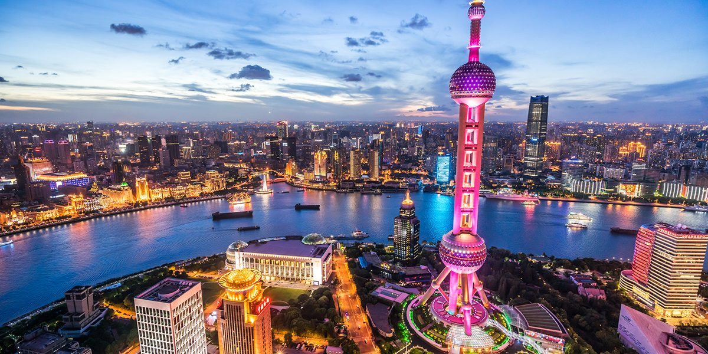
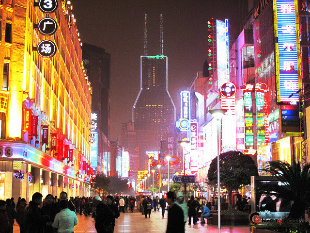

# 关于我和上海 (Guan Yu Wo He ShangHai) (About Me and ShangHai）

*Yu Garden Of Shang Hai*  ^^^^

[老师好大家好。](https://www.helloeveryone.studio/) [我要自我介绍。](https://notascaredycat.wordpress.com/2014/05/06/allow-me-to-introduce-myself/) [我的名字是产款物。](https://www.thoughtco.com/what-to-know-about-german-names-1444327). [我的岁是十九。](http://www.sohu.com/a/136143692_639367) [我不有朋友。](https://www.pinterest.com/pin/312789136602685460/).[ 我的朋友不喜欢我。](http://smszoo.com/hate-poems-friends-cheating-betrayal-friendship.html) [我的家有我的妈妈](https://www.pinclipart.com/pindetail/biRJTi_graphic-library-stock-2017-drawing-mothers-day-happy/)，[爸爸](https://www.history.com/topics/holidays/fathers-day)，[弟弟](https://en.wikipedia.org/wiki/Little_Brother_(group))，和[妹妹](http://www.dinelittlesister.com/)。[我喜欢睡觉。](https://www.clipartwiki.com/iclip/bwoTo_sleep-icon-clipart-sleep-icon/)我也喜欢吃[饺子](https://eatnorth.com/diana-ng/chinese-napa-cabbage-and-pork-dumplings-jiaozi)和[炒饭](https://www.google.com/search?q=chao+fan&tbm=isch&ved=2ahUKEwirxuen4aDlAhUWVFkKHdtzCIwQ2-cCegQIABAA&oq=chao+fan&gs_l=img.3..0l10.28820.29790..30020...0.0..0.73.508.8......0....1..gws-wiz-img.......35i39j0i67j0i131j0i3j0i10.SozGYeNeJb4&ei=TQqnXevrMZao5QLb56HgCA&bih=864&biw=1280&rlz=1C1CHBF_enUS853US870&safe=strict#imgrc=2eQcXCy3ZFmMVM)。我喜欢喝[可乐](https://www.walmart.com/ip/Coca-Cola-Classic-Soda-3L/16777273)。

Hello everyone, I am going to introduce you about myself. My name is Danny Tran (Chan Kuan Wu). I have no friends. My friends doesn't like me. In my family there are my mother, father, little brother and little sister. I like to eat dumplings and my favorite drink is soda coca cola.

 

# 参观的地点 （Cānguān dì dìdiǎn) (Places to visit)

1)[The Bund](https://travel.usnews.com/Shanghai_China/Things_To_Do/The_Bund_62575/)

2)[Shanghai Museum](https://travel.usnews.com/Shanghai_China/Things_To_Do/Shanghai_Museum_62573/)

3)[Zhujiajiao](https://travel.usnews.com/Shanghai_China/Things_To_Do/Shanghai_Museum_62573/)

4)[Shanghai World Financial Center](https://travel.usnews.com/Shanghai_China/Things_To_Do/Shanghai_World_Financial_Center_62571/)

5)[Yuyuan Garden](https://travel.usnews.com/Shanghai_China/Things_To_Do/Yuyuan_Garden_62576/)

6)[Longhua Temple](https://travel.usnews.com/Shanghai_China/Things_To_Do/Longhua_Temple_62586/)

7)[Jade Buddha Temple](https://travel.usnews.com/Shanghai_China/Things_To_Do/Jade_Buddha_Temple_62585/)

8)[Shanghai Maglev](https://travel.usnews.com/Shanghai_China/Things_To_Do/Shanghai_Maglev_62577/)

9)[Oriental Pearl TV Tower](https://travel.usnews.com/Shanghai_China/Things_To_Do/Oriental_Pearl_TV_Tower_62572/0)

10)[Nanjing Road](https://travel.usnews.com/Shanghai_China/Things_To_Do/Nanjing_Road_62574/)

# 1) THE BUND

1. Shanghai's picturesque waterfront, known as "the Bund," is where you'll find those classic skyline photo ops.

2.  Such as [the Oriental pearl](https://travel.usnews.com/Shanghai_China/Things_To_Do/Oriental_Pearl_TV_Tower_62572/) TV Tower, [the Shanghair World Fanancial Center](https://travel.usnews.com/Shanghai_China/Things_To_Do/Shanghai_World_Financial_Center_62571/) and other skyscrapers standing across the Huangou River.

3.  And behind you, gorgeous European-style buildings housing restaurants and shops (Nanjing Road is just around the corner) line the waterfront boulevard, affording plenty of activities.

4.  Visitors consistently report being in complete awe of Shanghai's skyline, so much so that some said skipping this attraction would be like skipping the Eiffel Tower in [Paris](https://travel.usnews.com/Paris_France/).

5.  It's better to go at night because all the beautiful lights would show off from the buildings shining in front of your face giving out a positive feeling! (It's really a relaxing feeling and stress free.)

# 2) Shanghai Museum

1.Frequently called one of the best museums in China,

2.This expansive museum houses a diverse collection of artifacts (more than 1,000,000 to be exact) that chart the nation's history.

3. English-speaking travelers, in particular, praised the museum for its presentation of both Chinese and English exhibit descriptions

4. Others loved the vast amount of historical articles available for view and appreciated the comprehensive history lesson they were able to get out of it.

5.  Keep in mind: Since there is no entrance fee, you're likely to encounter many others looking to take advantage of this freebie, so come early if you can.

# 3) Zhujiajiao

1.  The area remains composed of numerous canals with bridges connecting visitors to scores of charming narrow streets

2.  Expect to find tiny cafes down back alleys, friendly boatmen offering rides and hole-in-the-wall shops selling souvenirs.

# 4) Shanghai World Financial Center

1. The Shanghai World Financial Center stands as one of the world's tallest buildings, glittering majestically on the skyline.

2. Best place for bird eye view.

3. Take the 49-second elevator, which is one of the fastest in the world, to the 94th and 97th floors where you'll be treated to a jaw-dropping urban panorama.

4. The true highlight is on the 100th floor. Here, the Sky Walk – the world's highest observatory – allows guests to marvel at this Chinese metropolis from 1,555 feet above ground.

5. Those afraid of heights shouldn't try to conquer their fear here. BUT it's still a lovely view.

# 5) Yuyuan Garden

1.  The 5-acre Yuyuan Garden is the city's most revered green space.

2.  The garden took nearly 20 years to completely construct and was initially intended to be the private garden for Ming-dynasty official Pan Yunduan and his family.

3.  Here, you'll find six main scenic areas and 30 pavilions outfitted with ornate structures like decorated bridges and colorful pagodas as well intimate enclaves that are divided by "dragon walls" (partitions with stone dragons lying on top). Highlights include the Heralding Spring Hall, the Jade Magnificence Hall and the Lotus Pool. 

# 6) Longhua Temple

1.  Longhua Temple is a natural tourist attraction, drawing droves of travelers. The temple was built in the 10th century and is named after the pipal tree where Buddha is said to have reached enlightenment.

2.  Take time to explore the five main halls each filled to the brim with ornate sculptures, including numerous buddhas. Also take time to marvel at the more than 14,000-pound bell located in the bell and drum tower near the entrance. 

3.  Expect hordes of peach blossoms to make appearances in your photographs.

# 7) Jade Buddha Temple

1.  The temple was originally built to house two jade statues brought in from Burma

2.  In the Grand Hall, three golden Buddhas represent the incarnations of Buddha (past, present and future), while the Heavenly King Hall features four heavenly kings surrounding more buddhas, acting as divine protectors.

3.  There's also the Hall of the Reclining Buddha, which houses the second jade buddha statue, carved from a single piece of white jade.

# 8) Shanghai Maglev

1.  The Shanghai Maglev is one of the fastest passenger trains in the world

2.  Traveling at about 270 miles per hour, this train is the adult equivalent of the theme park ride.

3. Passengers on board the Shanghai Maglev are blasted between downtown and Pudong International Airport in about 7 minutes

# 9) Oriental Pearl TV Tower

1. Shanghai's most recognizable landmark, the Oriental Pearl TV Tower

2. Sitting a staggering 1,148 feet above the ground is the highest observation deck

3.  The Shanghai Municipal History Museum also resides here and merits a quick visit.

# 10) Nanjing Road

1. Nanjing Road stretches six miles total and boasts retailers from all over the world in addition to local shops and department stores.

2. In the daylight, you'll admire the graceful architecture of the surrounding buildings

3. At night, you'll marvel at the illuminated logos and brand names that line the avenue.

# [Here is a drone tour to Shang Hai](https://www.youtube.com/watch?v=-F8WA8Ir9WE)

